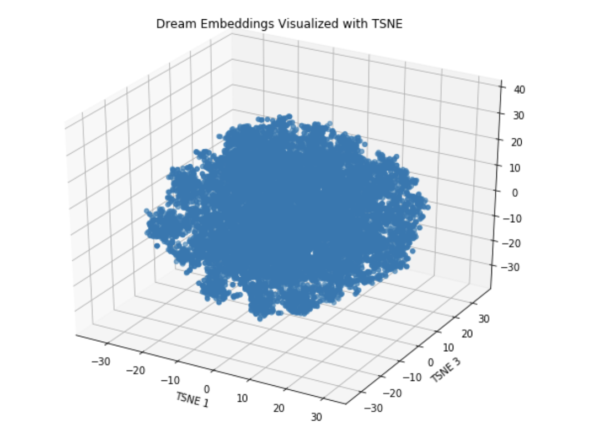

# Project Dreams

## Introduction: Dream Recommendation System
Project Members: Kazuki Shin, Ken Miyaki, Miao Li, Bhaswar Sarkar, Albert Nathan, Mark Villa

In this notebook, we will build a dream recommendation system based on simple principle: user like a dream will like simlilar dreams. In order to create this representation of similar dreams, we'll use the concept of neural network entity embeddings, mapping each dream to a X-number vector.

The idea of entity embeddings is to map high-dimensional categorical variables to a low-dimensional learned representation that places similar entities closer together in the embedding space. If we were to one-hot-encode the dreams (another representation of categorical data) we would have a 1M+ dimension vector for each dream, with a single 1 indicating the dream. In a one-hot encoding, similar dreams would not be "closer" to one another. By training a neural network to learn entity embeddings, we not only get a reduced dimension representation of the dreams, we also get a representation that keeps similar dreams closer to each other. Therefore, the key approach for a recommendation system is to create entity embeddings of all the dreams, and then for any dream, find the closest other dreams in the embedding space.

## Hypothesis:
Playing enjoyable Dreams is an on-ramp for deeper and longer engagement with the game.
People have personal preferences, and the process of finding a matching set of likeable Dreams has friction in actions such as typing text into the search UI and scrolling through random lists.
A Dream recommendation system can reduce this friction, and get players in front of enjoyable gaming experiences much sooner, thereby increasing the likelihood that they will stay engaged longer with the game.

## Work:
- Using data from Dreams about Dreams, players, and their interactions, create a model which reflects how much users ‘enjoyed’ each of the Dreams that they interacted with.
- Create an algorithm (SVD, DNN, or otherwise), which can learn from the input data and respective extracted features to recommend a Dream to a player in some sortable scored manor.
- Validate that the recommended Dreams are ‘good’ recommendations
- Characterize the recommendation system’s overall accuracy on its predictive capabilities (e.g., MSE)
- Create a Dreams recommendation network service which can work on the existing datasets, and allow for MM and others to evaluate the worth of this system over other techniques (such as SVD by Alex Evans or t-SNE)

## Target phases:
- For existing users, and existing Dreams in the system, recommend a set of Dreams for a person to play (that they haven’t already played); the goal of this is to try to extend existing user’s engagement with the game and to prevent them from churning.
- For new users, and existing Dreams in the system, recommend a set of Dreams for the person to play; the goal of this is to try to decrease bounce rate, and increase the favorability of their initial impression of the game by having them play through delightful Dream content (e.g., Hug Me)
- For new Dreams which don’t yet have any substantial play, attempt to link the characteristics/attributes of that Dream with known other characteristics/attributes (e.g., author, text tags, shared objects used, etc….) and recommend those new Dreams alongside existing Dreams such that we don’t end up with a reinforcing loop where only the existing Dreams are recommended, played, and thus more heavily weighted for subsequent recommendations.

## Measures:
- Did the person play the recommended Dream for at least the average play duration for that Dream?
- Did the person explicitly “like” the recommended Dream?
- Did the person go back and play the same Dream again?
 For people who engage with the recommended Dreams and end up playing them, do they stay engaged with the game for a longer period of time before churning? Do they go on to Create Mode and become Dream creators as a result of their longer retention?
- We start by targeting phase 1 – existing users, existing Dreams, a set of prioritized recommendations

## Approach
To create entity embeddings, we need to build an embedding neural network and train it on a supervised machine learning task that will result in similar dreams having closer representations in embedding space. The parameters of the neural network - the weights - are the embeddings, and so during training, these numbers are adjusted to minimize the loss on the prediction problem. In other words, the network tries to accurately complete the task by changing the representations of the dreams. 
- Load in data and clean 
- Prepare data for supervised machine learning task 
- Build the entity embedding neural network 
- Train the neural network on prediction task. 
- Extract embeddings and find most similar dreams. 
- Visualize the embeddings using dimension reduction techniques
